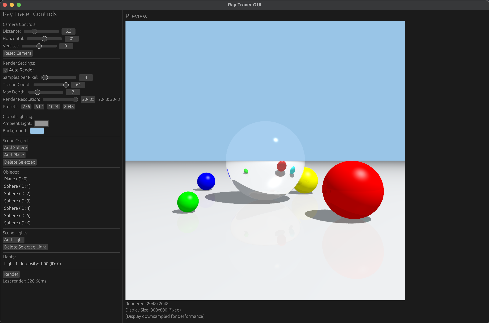

# ou-graphics
Simple Rust graphics library with basic linear algebra types, 3D primitives, and rendering tools.

Partially inspired by the "Fundamentals of Computer Graphics" (4th edition) by Marschner, Shirley, et. al.

## Features

### Ray Tracing
- Sphere, Plane, and Polygon primitives
- Point light sources with Phong shading
- Reflections and ambient lighting
- Multi-threaded rendering
- Anti-aliasing using sub-sampling

### Interactive GUI
- Real-time camera controls (distance, rotation)
- Object selection and manipulation
- Live preview with adjustable quality settings

## Usage

### Command Line Interface
```bash
# Render a scene to file
cargo run -- --scene mirror_ball --resolution 800x600 --output scene.png

# Available options:
# --scene [spheres|polygon|mirror_ball]
# --resolution WIDTHxHEIGHT
# --camera-distance DISTANCE
# --fov DEGREES
# --samples SAMPLES_PER_PIXEL
# --max-depth MAX_REFLECTION_DEPTH
# --threads THREAD_COUNT
# --output PATH
```

### Interactive GUI
```bash
# Launch the interactive GUI
cargo run --bin gui
```

#### GUI Controls:
- **Camera**: Adjust distance and rotation angles
- **Render Settings**: Adjust anti-aliasing samples per pixel, thread count, max depth, and resolution
- **Scene Objects**: Add and manipulate lights and other primitives
